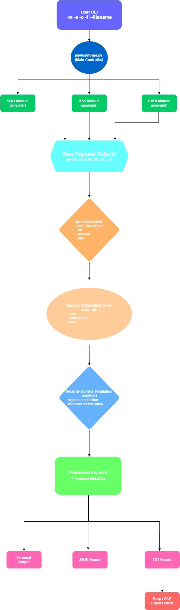

# PayloadForge

<p align="center">  </p>
<p align="center"> A Python-based modular payload generation and reconnaissance framework </p>
<p align="center"> Developed by <strong>OMEGA Team</strong> | Offensive Security & Penetration Testing </p>
<p align="center"> A modular, educational payload generation framework for modeling common web exploitation patterns and defensive detection logic. </p>



## Installation

Clone the repository:

```bash
git clone https://github.com/Meraj1312/payloadforge.git
cd payloadforge
```

Run as a module (recommended):

```bash
python -m payloadforge.payloadforge --module <module> [options]
```

## Requirements

*   Python 3.x
*   No external dependencies

## Important Notice

PayloadForge:

*   Generates payload templates only
*   Simulates defensive analysis
*   Does NOT execute payloads
*   Does NOT perform network scanning
*   Does NOT attack live systems
*   For educational and authorized testing only.

## Supported Modules

| Module | Description                   |
|--------|-------------------------------|
| `sqli`   | SQL Injection payload templates |
| `xss`    | Cross-Site Scripting payload templates |
| `cmdi`   | Command Injection payload templates |

## Encoding Support

| Option   | Description       |
|----------|-------------------|
| `none`     | No encoding (default) |
| `url`      | URL encoding      |
| `base64`   | Base64 encoding   |
| `hex`      | Hex encoding      |

**Example:**

```bash
python -m payloadforge.payloadforge --module xss --encode base64
```

## Obfuscation Support

| Option     | Description                       |
|------------|-----------------------------------|
| `case`       | Randomized case variation         |
| `whitespace` | Replace single spaces with multiple spaces |
| `tabs`       | Replace spaces with tabs          |
| `all`        | Apply all obfuscation techniques  |

**Example:**

```bash
python -m payloadforge.payloadforge --module sqli --obfuscate case
```

## SQL Injection Options

| Argument | Description                                    |
|----------|------------------------------------------------|
| `--database`     | Target DB: `all`, `mysql`, `postgresql`, `mssql` |
| `--sqli-type`   | Injection type: `all`, `error`, `union`, `blind`, `comment_bypass`, `case_variation` |

**Example:**

```bash
python -m payloadforge.payloadforge --module sqli --db mysql --type union
```

## XSS Options

| Argument   | Description                       |
|------------|-----------------------------------|
| `--xss-type` | `all`, `reflected`, `stored`, `dom` |
| `--context`  | `all`, `html`, `attribute`, `javascript` |

**Example:**

```bash
python -m payloadforge.payloadforge --module xss --xss-type reflected --context html
```

## Export Formats

| Format     | Description               |
|------------|---------------------------|
| `terminal` | Print to CLI              |
| `json`     | Export JSON file          |
| `txt`      | Export plain text         |
| `burp`     | Burp Suite compatible list |
| `zap`      | OWASP ZAP compatible list |
| `all`      | Export all formats        |

**Example:**

```bash
python -m payloadforge.payloadforge --module sqli --format json
```

## Custom Filename

If not provided, PayloadForge generates:

`payloadforge_<YYYYMMDD>_<HHMMSS>_<format>`

Custom:

```bash
python -m payloadforge.payloadforge --module xss --format json --filename custom_output
```

## CLI Help

```bash
python -m payloadforge.payloadforge --help
```

### Available Arguments

| Argument    | Description                                    |
|-------------|------------------------------------------------|
| `--help`      | Show help message                              |
| `--module`    | Required. Select module: `sqli`, `xss`, `cmdi` |
| `--encode`    | Encoding mode: `none`, `url`, `base64`, `hex` |
| `--obfuscate` | Obfuscation mode: `case`, `whitespace`, `tabs`, `all` |
| `--db`        | Target database (SQLi only)                    |
| `--type`      | SQL injection type (SQLi only)                 |
| `--xss-type`  | XSS vulnerability type                         |
| `--context`   | XSS injection context                          |
| `--format`    | Output format                                  |
| `--filename`  | Custom export filename                         |

Note: `--format` and `--filename` are listed last intentionally.

## Project Structure

```
payloadforge/
│
├── payloadforge.py
├── core/
│   ├── exporter.py
│   ├── generic_obfuscation.py
│   └── security_controls.py
├── encoders/
│   └── encode.py
├── modules/
│   ├── sqli/
│   ├── xss/
│   └── cmdi/
└── README.md
```

## Ethical Usage

This project is intended strictly for:

*   Educational purposes
*   Authorized security testing
*   Defensive research
*   Controlled lab environments

Users are responsible for ensuring legal and ethical usage.

## Roadmap

### Short-Term Goals
- [ ] Add SSTI module
- [ ] Add LFI module
- [ ] Improve risk scoring logic
- [ ] Add plugin-based module architecture
- [ ] Add unit tests for encoding and obfuscation

### Mid-Term Goals
- [ ] Support chained encodings
- [ ] Add YAML export format
- [ ] Add configuration file support
- [ ] Improve security simulation engine

### Long-Term Vision
- [ ] Defensive training mode
- [ ] Custom WAF rule simulation
- [ ] Modular extension marketplace
- [ ] Integration-ready output formats for security tools

PayloadForge aims to remain an educational, ethical security research framework.

# Defense Intelligence Output

PayloadForge simulates how defensive security systems (WAFs / filters) may classify generated payloads.

Each payload may include a simulated defensive response in the terminal output.

## Example Output
```
[Defense Info] {'blocked': True, 'detected_patterns': ['union select'], 'risk_level': 'high', 'reason': 'Matched known dangerous signatures'}
```
